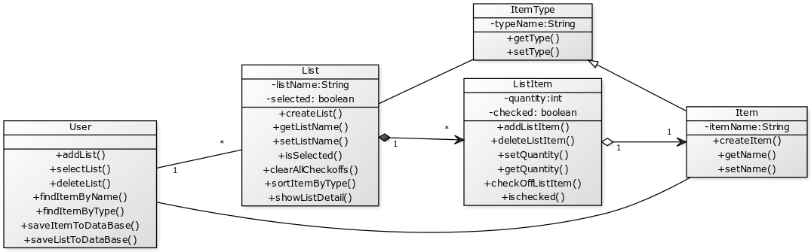

## Part A: Individual design  
 
### Design 1 (Amit Kushwaha: akushwaha9)
   

#### Pros 

* UML diagram is described in detail, with all the elements required to successfully generate correct implementation from the design.
* UML diagram is discussed in the design information in detail alongwith the requirements.

#### Cons 
* Misinterpreted describing 'checkoff' functionality as items being deleted from the list, instead of a checkoff flag being set for the grocery item. 

### Design 2 (Qiang Sheng: qsheng6)

#### UML 
   

#### Pros 
* Methods cover all requirements 

#### Cons
* Class ListItem is not directly associated with Class List 
 
### Design 3 (Li, Xu: lxu321)  

#### UML
   

#### Pros 
* This design has lots of methods, and all the requirements are nicely covered. 

#### Cons
* Some relations do not have a cardinality or direction 
  
## Part B: Team design  
  
#### Team UML
   

### Compare Team UML with Design 1  

#### Commonalities: 
* Has the same classes and the relationships.

#### Differences: 
* Design has a service layer but in the current iteration of the design we decided on not to use the service layer. Maybe this may change in a later iteration, but currently all operations reside in the respective domain classes of the domain model. 
* Team decided to use 'Set' instead of 'List'. 'Set' prevents duplicates, we can later extend GrocerySet from a Set to inherit all the operations. We won't have the requirement to add the same item twice, just change the quantities.
* UML model shows constructors to represent how objects are created, which is also useful for implementation.
* Domain model has static 'list' operations to return a list of entities and a 'save' operation to save the domain state. 

### Compare Team UML with Design 2  

#### Commonalities: 
* Have key classes such as GroceryList, GroceryListItem and Item like the team design. 

#### Differences: 
 
* I design my app with multiple users, while team UML is designed for a single user. 
* I have an association class ListItem between User class and Item class. In team UML, all relations are composition.  
* I assign ItemUnit as an attribute for class ListItem. In team UML, GroceryItem has a reference to quantity type. (ListItem is equivalent to GroceryItem, while ItemUnit is similar to  quantity type) 
* I use list in my design. For team design, we decide not to use list in class name. 

### Compare Team UML with Design 3  
#### Commonalities: 

* The core class relations. All three member in our group have the GroceryList, GroceryListItem and Item classes, so the team UML also adopts this structure. 
* This app is designed for a single user and does not support modification from multi users. 
 
#### Differences:  
 
* In my design, the relation between Item and ItemType is inheritance. I thought that item can inherit item type (apple inherits fruit). In the team UML, we decided to define this relation to be composition (fruit contains apple). 
* I was originally confused by where I should put all the operations upon a subject. I put, for example, removeList() and findItemByType() into the User class. After team discussion, I realized that operations can be a part of the domain model, as a static method or they can be put into the service class. So in both cases, we should keep operations for a class into the design of that class. 
* I did not include the class QuantityType. I think it is a good design idea. We now have it in the team UML 
* I originally have a method selectList() , but according to our discussion,  it is probably not necessary during coding. Similarly sortItemByType() is not necessary, since sorting is a coding detail. So the team UML has them removed. 
 
### Summary 

#### Li Xu
* First, teamwork is important and I am happy that I have a nice chance to practice. It is not easy for us, as all three of us are located at different time zones. That means we do not have overlapping study time for group discussion except weekends. So we use Slack, which allows us to exchange thoughts and ideas back and forth. It works out nicely and I am looking forward for the next step. 
* Second, I learnt a lot during collaboration. As a biomedical research scientist, I do bench works during time day. Although I become interested in computer sciences and software development, I do not have much coding experiences. It is extremely helpful to learn from my teammates about how things should be done properly. It is also good to have a taste of what real developing process is like, via this group project. 

#### Qiang Sheng

* I learned a lot from my teammates. As a software system becomes more complicated, and involves more people, it is very critical to think about implementation even in the design phase.  

#### Amit Kushwaha

* Design: More or less all our key classes were the same, with some differences, pros and cons as indicated above. We were able to incorporate the best ones into the team design.
* Team Work: Our team is on 3 different timezones and everyone has full time jobs and some are enrolled in more than 1 course this semester. We are able to handoff the work done in one timezone to another timezone. This highlights great teamwork. This could work very well for us in the implementation phase where on a given day we can have a long distributed development cycle (i.e due to different timezones).
* Communication: We managed to communicate effectively and complete this assignment more or less by just using Slack and simple shared documents. Communication using these tools worked exceptionally well for us.