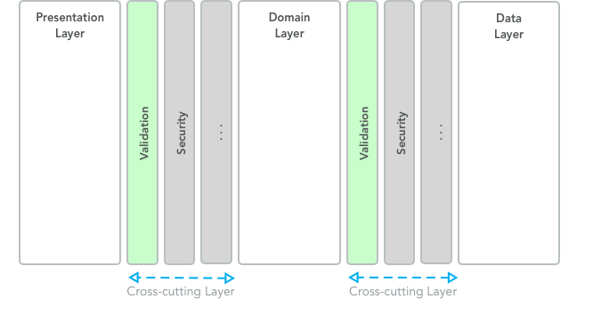
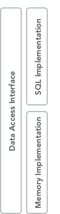
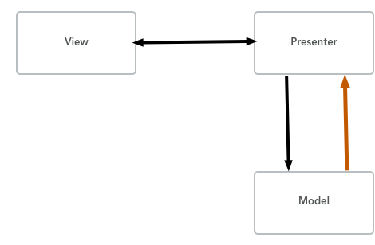
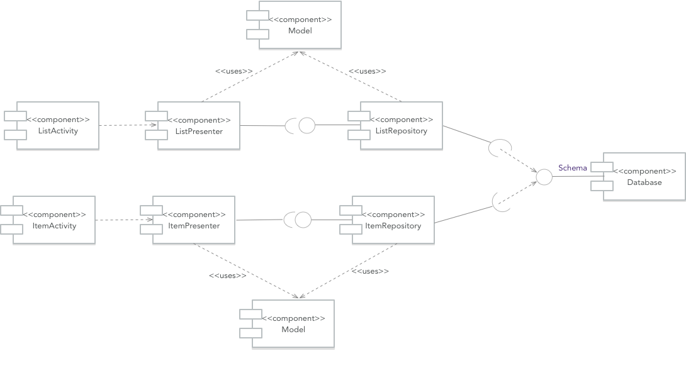
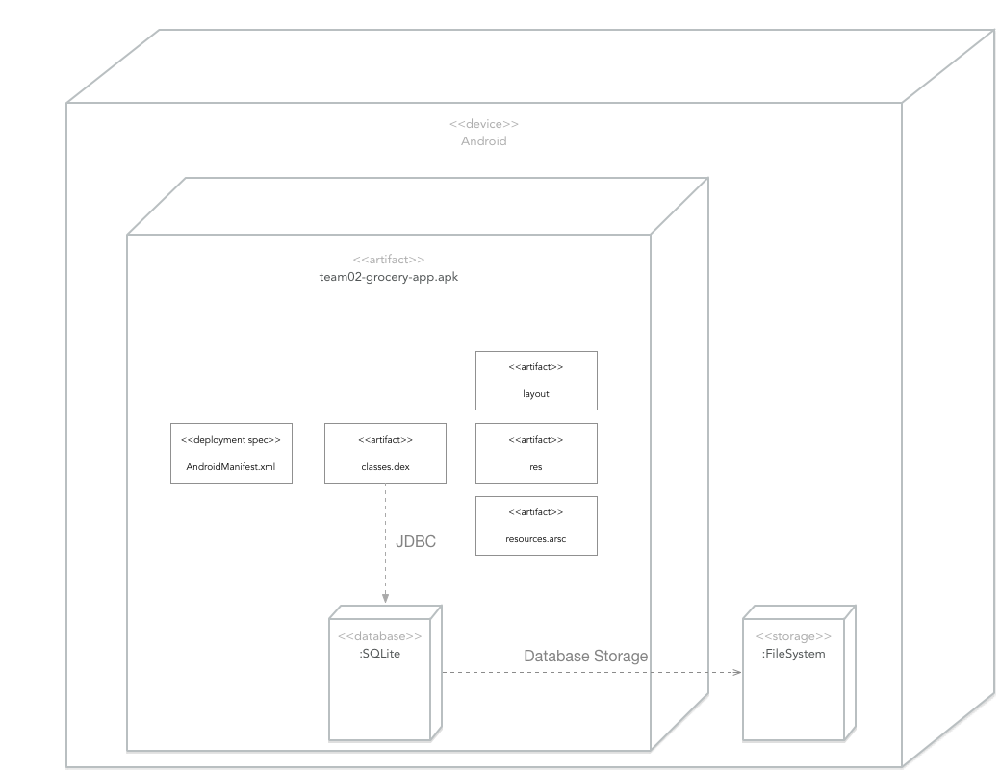
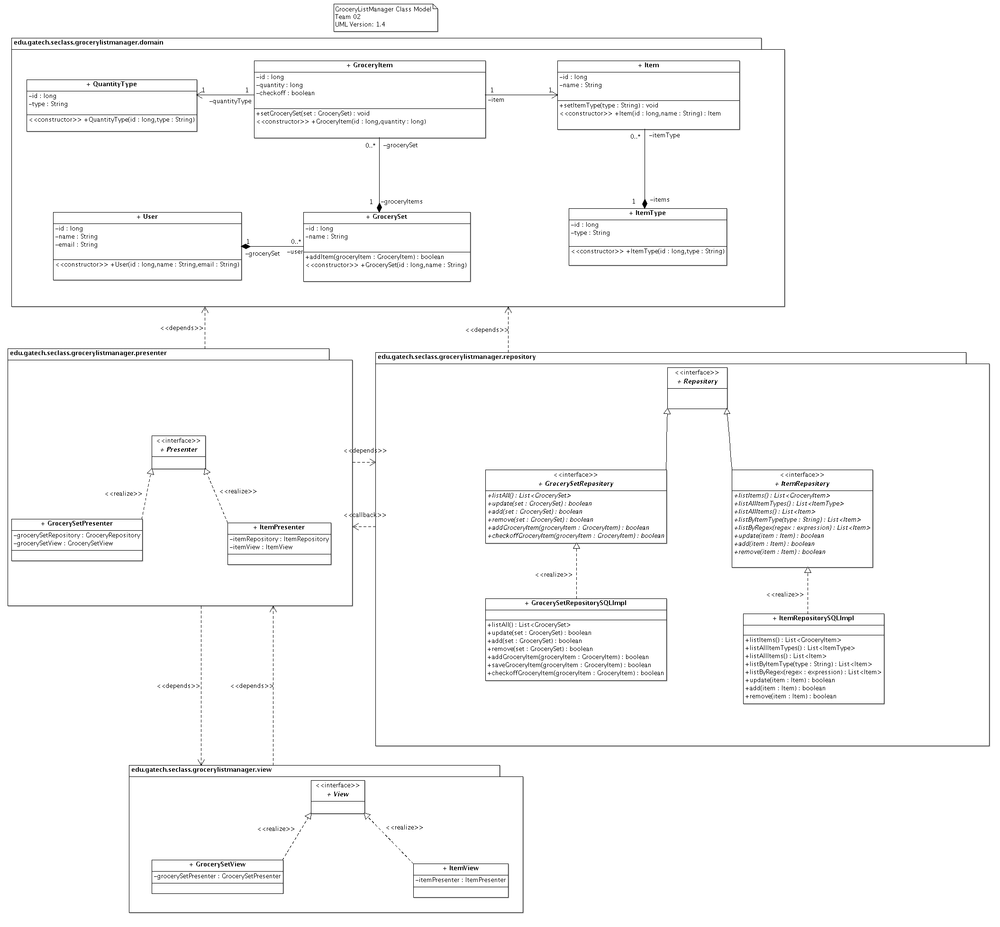
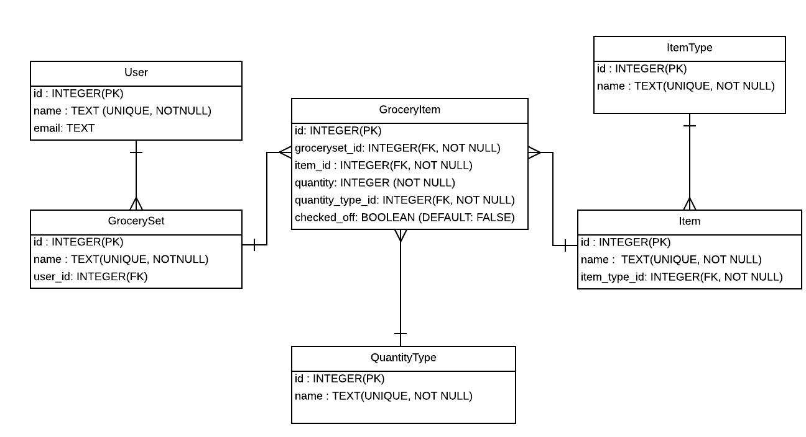
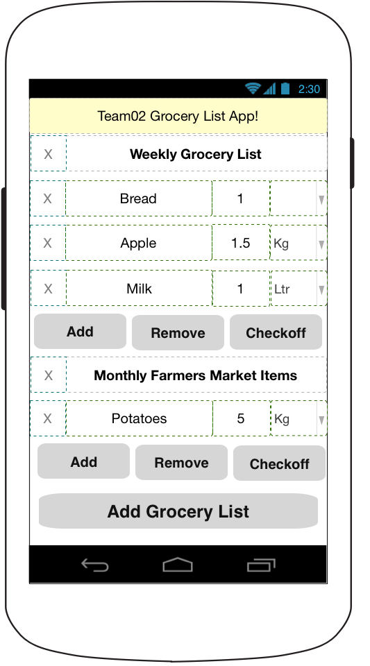
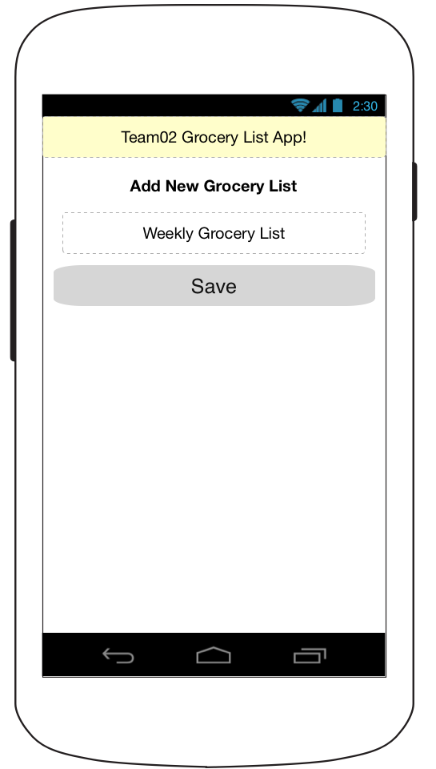
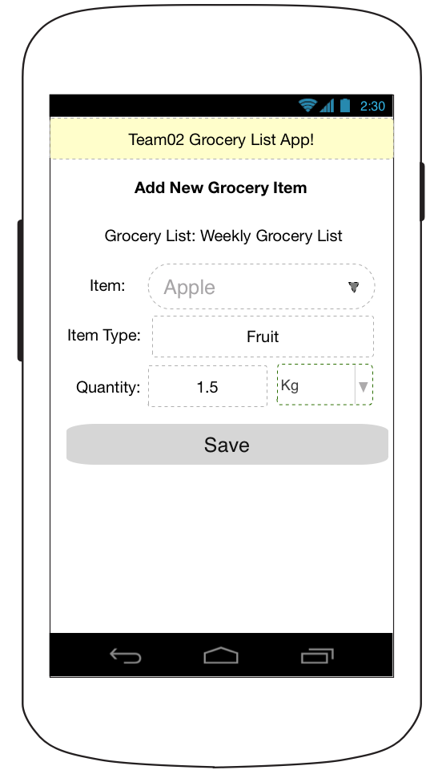

# Design Document

**Author**: Team 02

## 1 Design Considerations

The subsections below describe the issues that are addressed or resolved prior to or while completing the design, as well as issues that may influence the design process.

### 1.1 Assumptions

- The application is deployable only to Android platforms.
- The min SDK level suppored is 21. This would cover 50% of the current android users as per, https://developer.android.com/about/dashboards/index.html. 
- To support >75% users we are thinking about also supporting SDK level 19.

### 1.2 Constraints

- The constraints of the application are the following:
    - Capture 50% to >75% of marketshare for which we would need to rely on older APIs instead of newer ones. 

### 1.3 System Environment

- The hardware the application runs on are android devices where the SDK level satisfies the products minimum API level.
- The software versions are as follows:
    - JDK Version: 7
    - SQLite Version: 3.x
    - Min Android API Level: 21
- The application will be deployed using Gradle.    

## 2 Architectural Design

### 2.1 Layered Design

The architectural layers of the application are shown below:

We use a layered design for the following reasons:

- To modularize the code for the application.
- To aid in testing.
- To extend the application for future requirements.

As shown in the diagram, common cross-cutting concerns will be applied to each layer with cross-cutting modules added as
per the requirements. Currently, we only require the 'validation' and the 'exception handling' concern. The 'Security' and the unnamed concerns are shown for
demonstration purposes only. 

### 2.2 Data Interfaces

In addition to the layers, we use an interface centric approach to cleanly separate the interaction between layers
from the implementation. This is currently applied to the data layer but could be added to other areas (for ex, Business Logic, Integration etc) as per the requirements. An interface based approach also allows us to switch implementations without
impacting the clients of the interface, this is also useful for testing where we can use mock-testing for dependent layers.
Currently, we implement a SQL implementation and an in-memory implementation for testing. This is shown below:

### 2.1 Model-View-Presenter

In addition to layers and interfaces the application uses a Model-View-Presenter architecture as shown below:

The arrows indicate the direction of interaction between the components. Model to Presenter interaction could also be asynchronous as shown with the red arrow in the above diagram.

### 2.1 Component Diagram

The component model for the system is described below:

As shown in the above diagram we have 4 main components:
- Views
- Presenters
- Repositories (for data access) and finally
- Database with the schema

### 2.2 Deployment Diagram

The deployment diagram for the system is described below:

As shown in the above diagram we deploy the android apk on all android devices. The apk itself is composed of the following artifacts:

- AndroidManifest.xml: The deployment specification of our application.
- classes.dex: Compiled classes from the projects and other libraries.
- layout: The layout artifact contains in xml format the layout of our application.
- res: The uncompiled resources for our application.
- resources.arsc: The compiled resources for our application.

The data access components of the application access data using JDBC to an SQLite instance running within the apk. The database records are stored in the following location:

/data/data/team02-grocery-app/databases/groceries

## 3 Low-Level Design

This section describes the low-level design of the system such as the class diagram and the entity relation diagram.

### 3.1 Class Diagram

The class diagram for the domain model is shown below:

As shown in the above diagram our class diagram is represented in different modules, with each module corresponding to an architectural layer. The module dependencies are also shown in the class diagram. The inter-dependence of modules is reduced by using interfaces. We may try to reduce this dependency even further by using a dependency injection framework during the development phase. 

For the cross cutting concerns we may write aspects or just rely on regular java classes.

In addition to the classes, some utility classes may be added during the implementation phase.

### 3.2 Other Diagrams

#### 3.2.1 Entity-Relation Diagram

The entity relation diagram for the application is shown below:

The database name is: **groceries**. The database access would require a username/password to access the database schema and this database user and configuration would be loaded from a configuration file within the android application.

## 4 User Interface Design
This section describes the wireframe UI design for the application. The wireframes presented here are to demonstrate the functionality as described in the use cases. The wireframe UI design could change or be improved for a better UX experience for the user. For example, we could add a much better UX experience by allowing the user to add, edit and view all the grocery items in one view instead of three. Currrently for the purpose of design, we have three separate UI's for this appliation which are described and shown below.

### 4.1 All Grocery Lists Wireframe
This UI displays a listing of all the grocery lists and their corresponding grocery items. The user can add, remove, checkoff and update the names and quantities of both the grocery list and the grocery item. The wireframe is below:

### 4.2 Add Grocery List Wireframe
This UI allows the user to create a new grocery list. Once a grocery list is created, the user is shown all his grocery lists. The wireframe is below:

### 4.3 Add Grocery Item Wireframe
This UI allows the user to add a new grocery item to the grocery list. The user can search for an item in the grocery list and if the item is not found the user can save the new item and the item type. Once a grocery item is added to the grocery list, the user is shown all his grocery lists with the newly added item. The wireframe is below:

