# GroceryListManager User Manual

**Author**: Team 02

###Release 1.0.0
Last Revised Oct 14th, 2016

## 1 Introduction

Welcome to GroceryListManager!

GroceryListManager, is an android application that provides an interactive tool to manage your grocery lists on your android devices.

This guide will introduce you to all of the features available. You will learn how to manage(create/delete/name) grocery lists, manage (add/remove/checkoff) grocery items into the lists and more.

## 2 Table of Contents  
<ol>
<li>Introduction </li>
<li>Table of Contents </li>
<li>Navigation</li>
<li>Adding a grocery list </li>
<li>Deleting a grocery list</li>
<li>Rename a grocery list</li>
<li>View items into a grocery list</li>
<li>Add an item into a grocery list</li>
<li>Delete an item from a grocery list</li>
<li>Checkoff an item in a grocery list</li>
</ol>

## 3 Navigation 
In general, to proceed forward in the application, tap on button. To return to a previous screen, press the back button on your Android device.

## 4 Adding a grocery list

* The home screen displays a listing of all the grocery lists and their corresponding grocery items. To add a grocery list, first click on the "Add Grocery" button
 
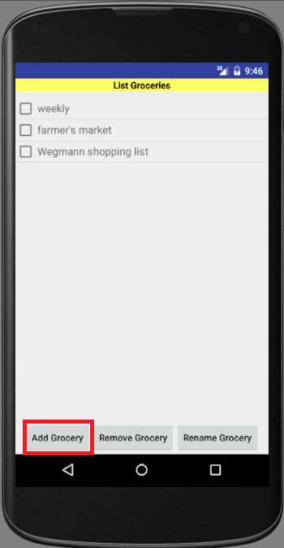

* Then click on the text box, type in the name of the new grocery list and press the "Add" button.

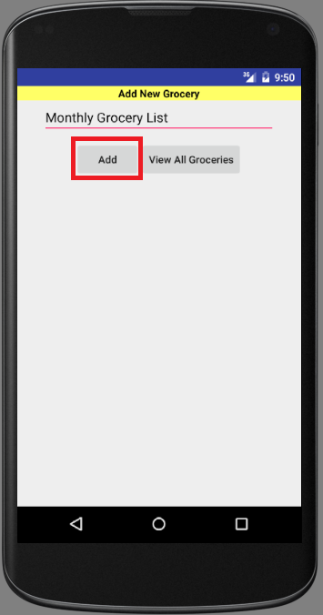

## 5 Delete a grocery list
* On the Home screen click on checkbox the next to the name of a grocery list and press the "Remove Grocery" button.

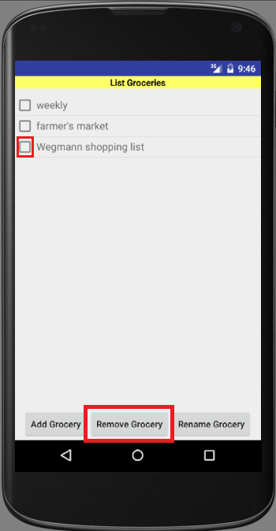

## 6 Rename a grocery list
* On the Home screen click on checkbox the next to the name of a grocery list and press the "Rename Grocery" button.

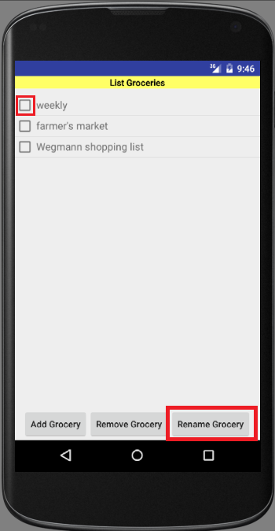

* Then click on the text box, type in a new name of the selected grocery list and press the "Rename" button.

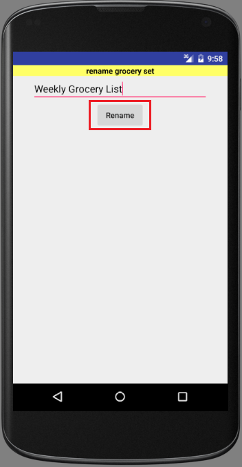

## 7 View items into a grocery list
* On the Home screen tap on the name of the grocery list to view items in it.

 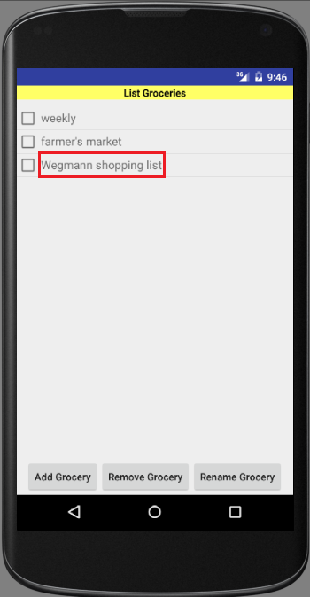

then items show up

 

## 8 Add an item into a grocery list
* press "Add" button to add a new item to this grocery list.

 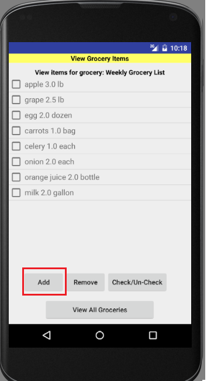

* Then type in the name, type, quantity and unit of the item and press 'Add Item'

 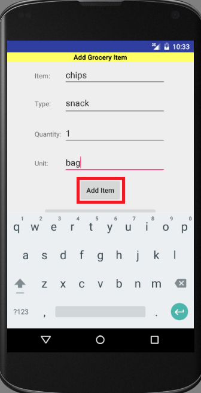

* When input matches item stored in the database, the name show up in the auto-completion tab.

 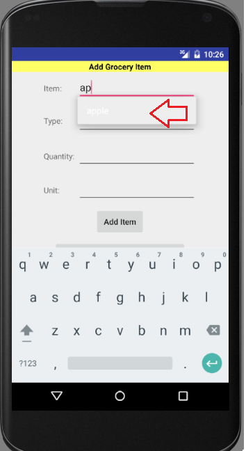

## 9 Delete an item from a grocery list
* Click on checkbox the next to the name of a grocery item and and press the "Remove" button.

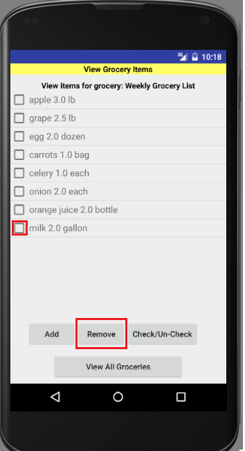

## 10 Checkoff an item from a grocery list
* Click on checkbox the next to the name of a grocery item and press the "Check/Un-check" button.

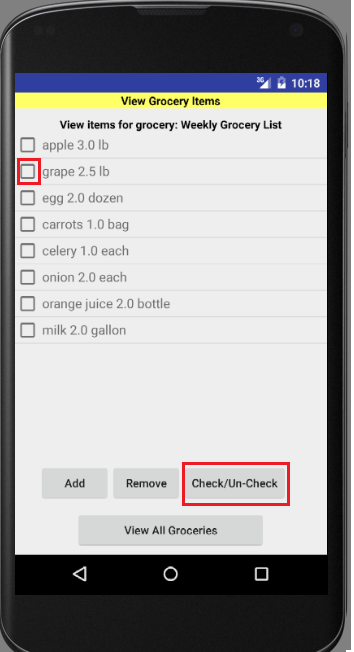

Then item shows up as checked off.

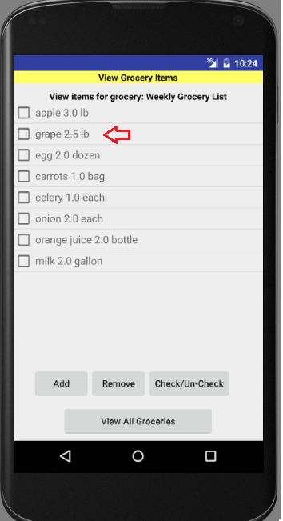

***

[Go back to Table of Contents](#tc)
